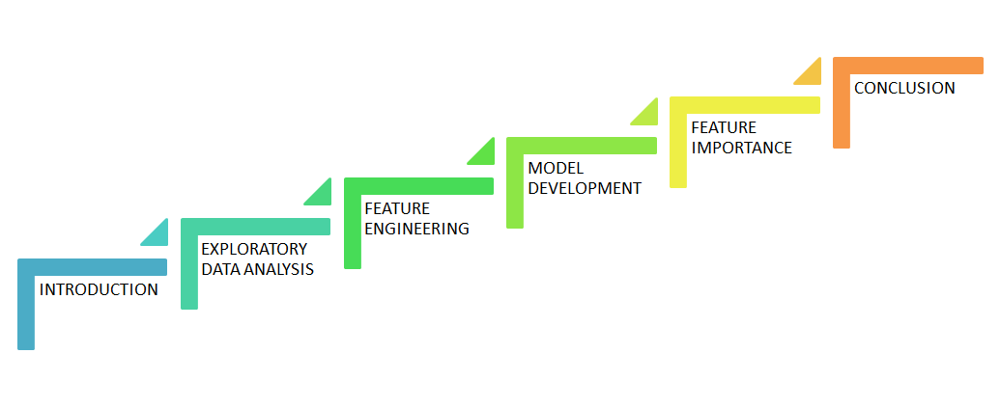
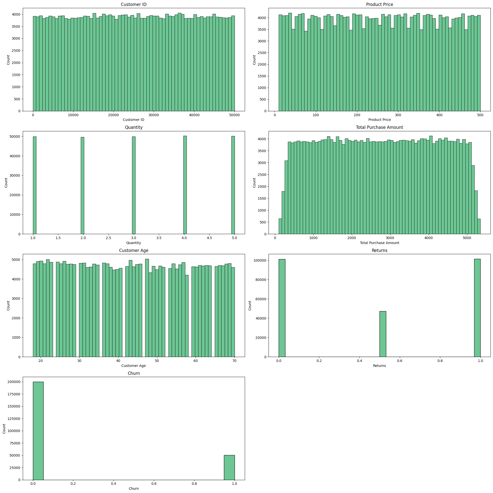
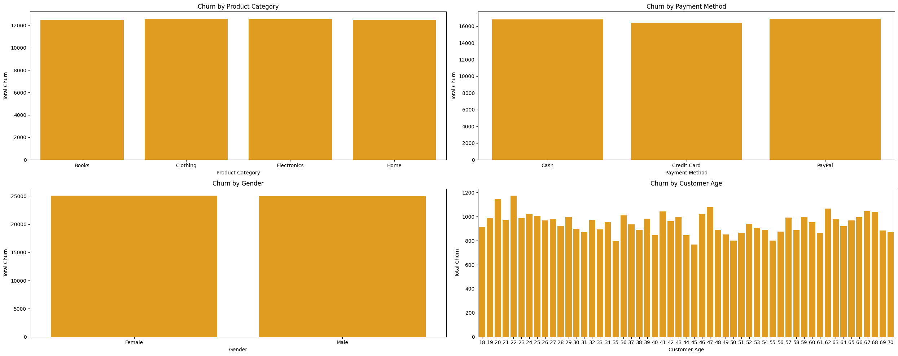
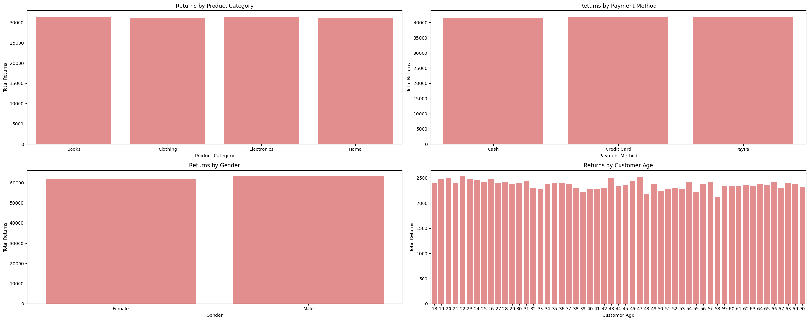
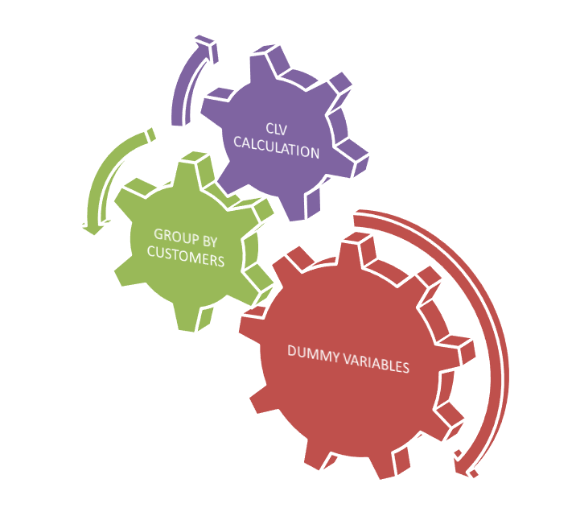

# E-Commerce-CLV-Prediction

## Introduction 

The e-commerce customer dataset includes 13 variables, such as purchase date, purchase amount, product category, quantity, returns, churn status, and others.

Customer lifetime value (CLV) is a critical metric because it enables businesses to make smarter, data-driven decisions that foster customer loyalty, reduce acquisition costs, and ensure sustainable profitability. As a result, CLV is a cornerstone metric for long-term business success.

The objective of this project is to develop a CLV prediction model. By leveraging this model, the e-commerce company can make strategic decisions based on predicted CLV. For example, discounts can be offered to customers with low predicted CLV to boost engagement, while loyalty programs can be targeted toward high-CLV customers.

## Table of Contents

1. Introduction
2. Exploratory Data Analysis (EDA)
3. Feature Engineering
4. Model Development
5. Feature Importance
6. Conclusion

## Exploratory Data Analysis (EDA)

### Visualization of continuous variables

### Churn and return rates show heavily concentrated in any specific variables?

### Key Findings

The churn rate is 20%, and the return rate is 50%. These rates are evenly distributed across the following factors:

- Product Category
- Payment Method
- Gender
- Customer Age

Churn and return rates do not appear to be heavily concentrated in any specific feature. Although the churn rate is slightly higher among customers in their 20s and lower among those in their 40s, returns are relatively evenly distributed across age groups.

Therefore, product and service improvements should be implemented broadly rather than targeting specific customer segments or products.

## Feature Engineering

1. Create dummy variables to represent categorical variables
2. Group by customers
3. Calculation CLV - (Purchase value X Frequency X Customer lifespan)

*Independent Variable  -> [['Total_returns','Books', 'Clothing', 'Electronics', 'Furniture', 'Payment_Cash','Payment_Credit', 'Payment_Paypal', 'Gender_Female','Age', 'churn']]
*Dependent Variable -> [['CLV']]

